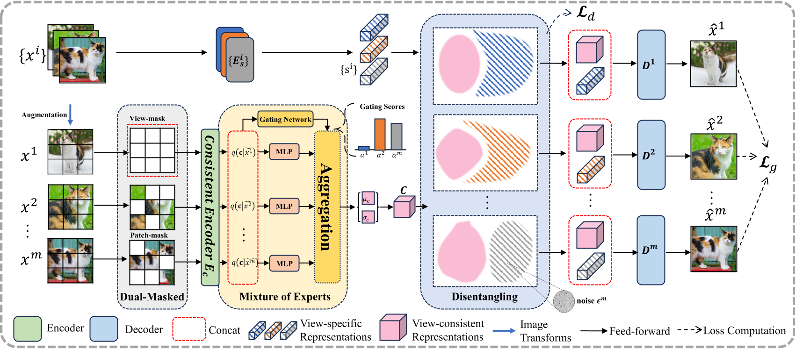

# DualVAE

The official repos for "Learning Robust Multi-view Representation Using Dual-masked VAEs" (DualVAE)

- Accepted by **IJCAI 2025**



## Training step

First switch to the root directory of the project, then run the command :

```pyth
python train.py -f [config file]
```

## Evaluation step

First fill in the path of pretrained model to `eval.model_path` domain in corresponding config file.

Then run the command:

```
python eval.py -f [config file]
```

